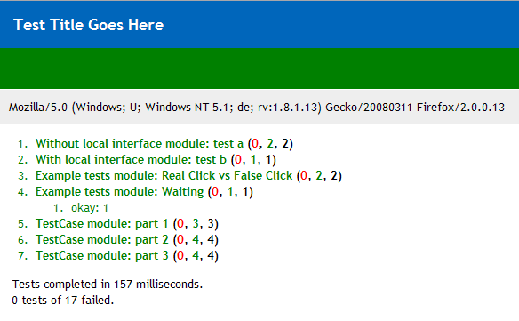

<p>jQuery Tests, jsUnit compatible, for all frameworks</p>
<p>
<strong>UPDATE</strong>
You may want to use <a href="http://docs.jquery.com/QUnit">QUnit</a>, its maintained by the jquery-team and has all features of jQUnit except JSUnit compatability/global-namespace-polution-freeness</p>

<h2>Goals</h2>

<p>A Testrunner that does not pollute the globel namespace and is JSUnit compatible.</p>

<p><a href="http://groups.google.com/group/jquery-en/msg/b6b7ff05f5f06945">source&amp;idea</a></p>

<h2>Usage</h2>

<h3>Test Output</h3>

<ul>
<li>Click one to unfold Test - Results</li>
<li>Double Click to rerun the selected Test</li>
<li>test.html?xxx -&gt; run only tests that match /xxx/</li>
</ul>

<h3>Test Suite</h3>

<p>Making Test Suites: just link <code>source</code> to the .js files that hold tests, or call window.location when your first test is done.</p>

<h3>Test Case</h3>

jqUnit tests often do not need setup or teardown, or the Test Case.
But if you need them use them as follows:

```js
//Using TestCase
jqUnit.TestCase.prototype.yep = function(val){ this.ok(val);};
var t = new jqUnit.TestCase('TestCase',function(){
    /*setup*/
    this.yep(1);
  },function(){
    /*teardown*/
    this.ok(1)
  });
//jqUnit is mixed into TestCase, so you can overwrite them &amp; only need 1 with(){}
t.test('part 1',function(){ this.ok(1) });
t.test('part 2',function(){ with(this){ ok(2);yep(3) } });
t.test('part 3',function(){ with(jqUnit){ ok(4); this.yep(5) } });
```

<h3>Examples</h3>



```js
var temp = function ($){
  jqUnit.module('Without local interface');
  jqUnit.test('test a', function(){
    jqUnit.ok(true);
    this.ok(true);
  });

with(jqUnit){
  module('With local interface');
  test('test b', function(){
    ok(true);
  });

module('Example tests');
  test('Real Click vs False Click',function(){
    var clicked = false;
    $('#test-form').click(function(){clicked=true;});

//false click
$('#test-form input').click();
ok(!clicked);

//real click
triggerEvent($('#test-form input').get(0),'click');
ok(clicked);
});
```

```js
  test('Waiting',function(){
    $('#ajax').load('fixtures/1.html');
    expect(1);//expect 1 assertion, here: fails if ajaxStop is never called
    stop();//pause: so we can wait with setTimeout,setInterval,...

$().ajaxStop(function(){setTimeout(function(){
  //field is not filled directly after ajaxStop
  //since DOM traversal comes after stopping to load
  equals($('#ajax').html(),1);//!reverted jsUnit order
  start();//resume: make sure its called or tests will halt!
})});
});
}}(jQuery);
```

<p>More examples can be found here:
jQuery Test Suite <a href="http://dev.jquery.com/browser/trunk/jquery/test">Repository</a> <a href="http://jquery.com/test/">Live</a></p>

<h2>Used at</h2>

<p>If you run your tests at a public domain, please send me a mail an i will list it here.</p>

<h2>Changes</h2>

<p>v1.1.1 - refactoring, interface stabel
v1.1 - jqUnit is now mixed into TestCase so this will work as expected</p>
